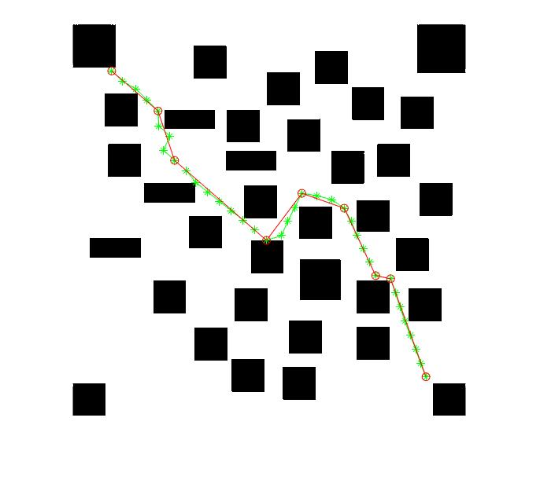

# Path Planning Project

Rapid-Exploring Random Tree (RRT) method

## Few Results

- Naive RRT building

- RRT pruning and visibility handling

- Turning corner constraints reinforcement

- Bidirectional RRT 

- Computation Time Comparison

**Requirements**

- Matlab R2013a or later.

License
============

RRT (Rapidly-Exploring Random Trees) using [the MIT license](LICENSE).
