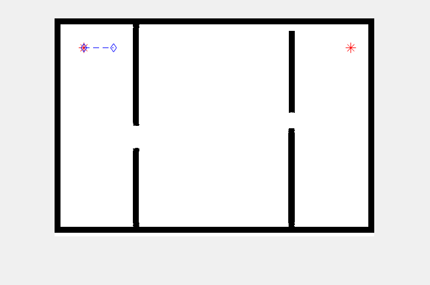

# Sampling-based Motion Planning Simulation 

This is a simulation using Matlab + Vrep

## Classic RRT implementation

narrow environment path selection

maze environment path selection

## BiRRT implementation

## MultiRRT implementation

