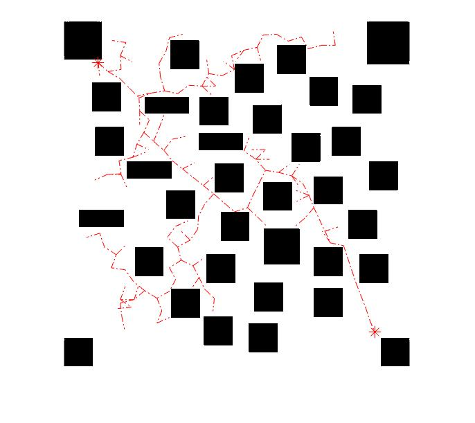
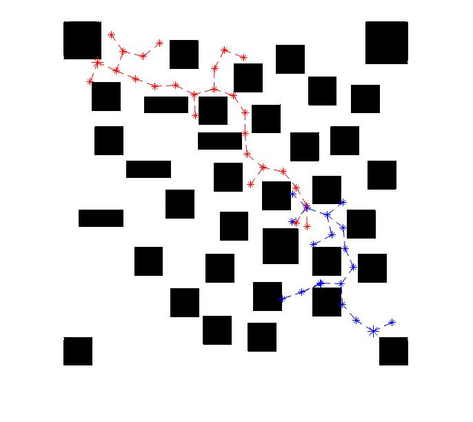
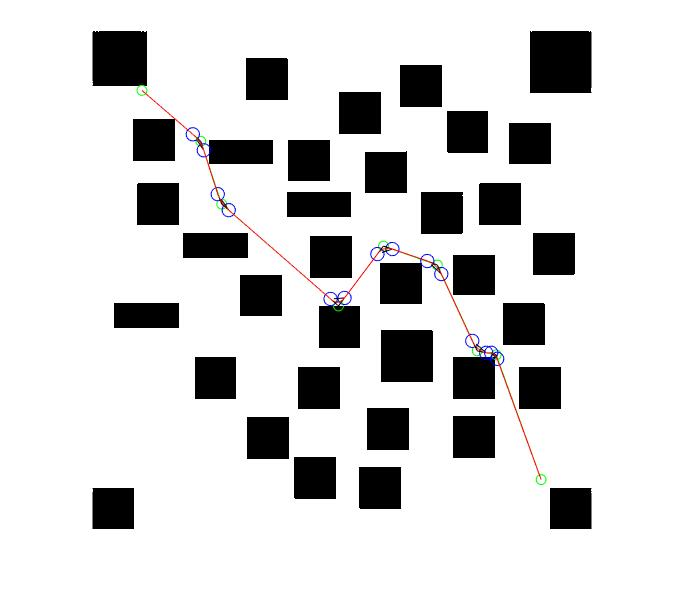
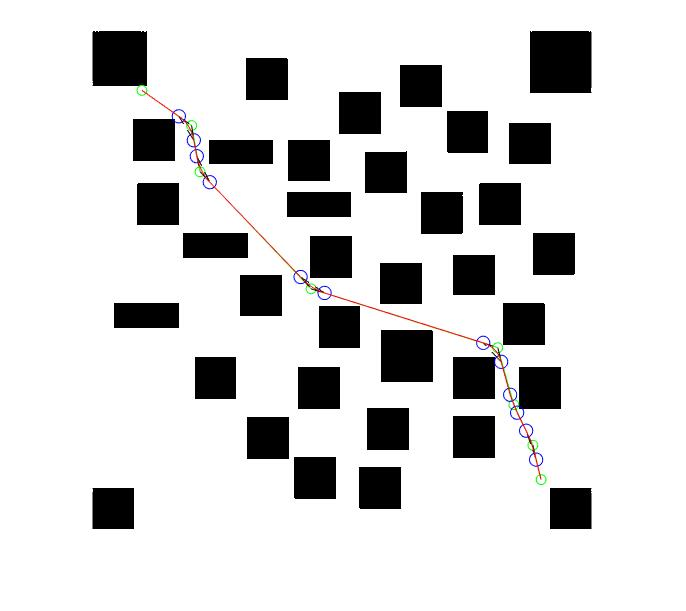
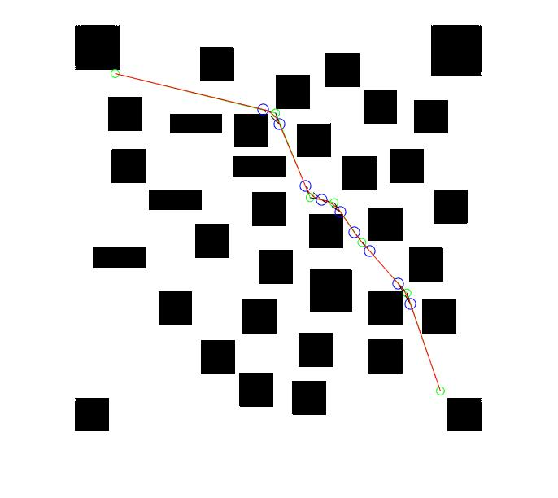

# Sampling-based Motion Planning Simulation 

MATLAB 2017a or later is recommended.

## Some Results

1. narrow environment tree generation(sRRT, biRRTs)

   

       
       
       
   

2. narrow environment path generation (sRRT, biRRTs), with curve smoothness.

    
    
    

# License

RRT (Rapidly-Exploring Random Trees) using [the MIT license](LICENSE).
