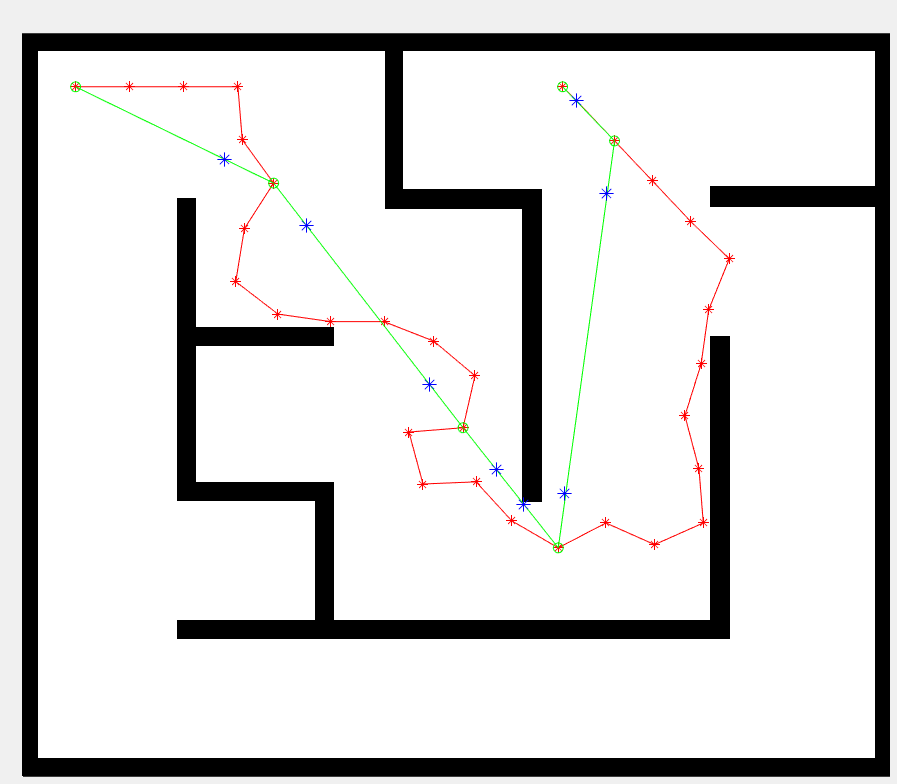

# Sampling-based Motion Planning Simulation 

Lewis.

This is a simulation using MATLAB plus V-rep

## Classic RRT implementation

1. narrow environment path selection

    

2. maze environment path selection

    

3. classic RRT path finding and foundational smooth (with blue star point as for further curvation):

    

4. classic RRT smooth curve generated (Red Curve).

   As black triangle as convex hull to constraint the curve. 

    

# License

RRT (Rapidly-Exploring Random Trees) using [the MIT license](LICENSE).
